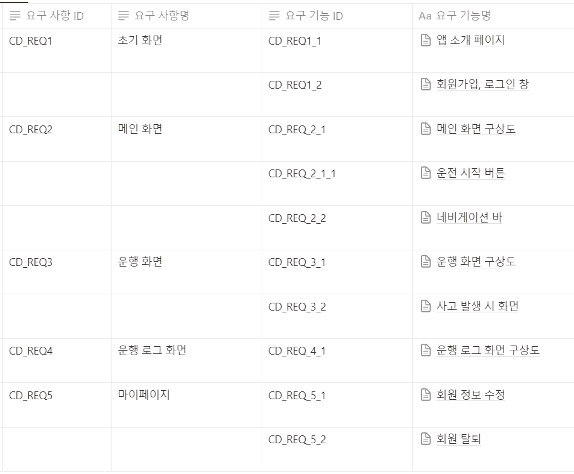

# APP 기능 명세서

---

TABA App 기능 명세서입니다.

항목을 선택하시면 더 자세한 정보를 보실 수 있습니다.

[CD_REQ1_1 앱 소개 페이지](https://github.com/Project-Taba/functional_specification_app/blob/main/CD_REQ1_1%20%EC%95%B1%20%EC%86%8C%EA%B0%9C%20%ED%8E%98%EC%9D%B4%EC%A7%80.md)

[CD_REQ1_2 회원가입, 로그인](https://github.com/Project-Taba/functional_specification_app/blob/main/CD_REQ1_2%20%ED%9A%8C%EC%9B%90%EA%B0%80%EC%9E%85%2C%20%EB%A1%9C%EA%B7%B8%EC%9D%B8%20%20.md)

[CD_REQ2_1 메인 화면 구상도](https://github.com/Project-Taba/functional_specification_app/blob/main/CD_REQ2_1%20%EB%A9%94%EC%9D%B8%20%ED%99%94%EB%A9%B4%20%EA%B5%AC%EC%83%81%EB%8F%84.md)

[CD_REQ2_1_1 운전 시작 버튼](https://github.com/Project-Taba/functional_specification_app/blob/main/CD_REQ2_1_1%20%EC%9A%B4%EC%A0%84%20%EC%8B%9C%EC%9E%91%20%EB%B2%84%ED%8A%BC.md)

[CD_REQ2_2 네비게이션 바](https://github.com/Project-Taba/functional_specification_app/blob/main/CD_REQ2_2%20%EB%84%A4%EB%B9%84%EA%B2%8C%EC%9D%B4%EC%85%98%20%EB%B0%94.md)

[CD_REQ3_1 운행 화면 구상도](https://github.com/Project-Taba/functional_specification_app/blob/main/CD_REQ3_1%20%EC%9A%B4%ED%96%89%20%ED%99%94%EB%A9%B4%20%EA%B5%AC%EC%83%81%EB%8F%84.md)

[CD_REQ3_2 사고 발생 시 화면](https://github.com/Project-Taba/functional_specification_app/blob/main/CD_REQ3_2%20%EC%82%AC%EA%B3%A0%20%EB%B0%9C%EC%83%9D%20%EC%8B%9C%20%ED%99%94%EB%A9%B4.md)

[CD_REQ4_1 운행 로그 화면 구상도](https://github.com/Project-Taba/functional_specification_app/blob/main/CD_REQ4_1%20%EC%9A%B4%ED%96%89%20%EB%A1%9C%EA%B7%B8%20%ED%99%94%EB%A9%B4%20%EA%B5%AC%EC%83%81%EB%8F%84.md)

[CD_REQ5_1 회원 정보 수정](https://github.com/Project-Taba/functional_specification_app/blob/main/CD_REQ5_1%20%ED%9A%8C%EC%9B%90%20%EC%A0%95%EB%B3%B4%20%EC%88%98%EC%A0%95.md)

[CD_REQ5_2 회원 탈퇴](https://github.com/Project-Taba/functional_specification_app/blob/main/CD_REQ5_2%20%ED%9A%8C%EC%9B%90%20%ED%83%88%ED%87%B4.md)
